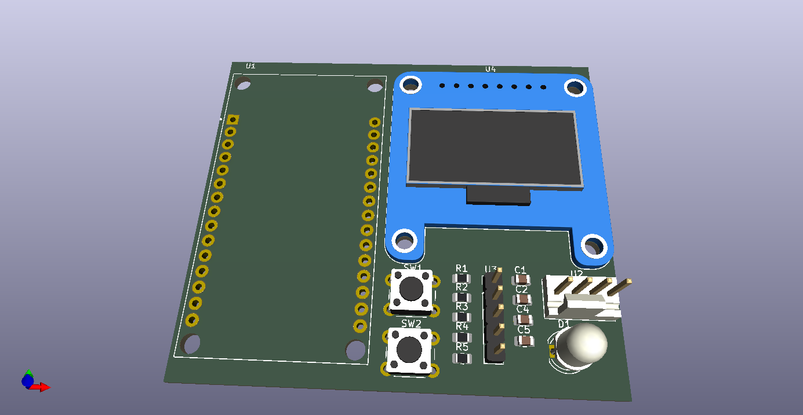

<div align="center">

# ⚡ Jolt Locator

### GPS-Based Energy Drink Store Finder


[](https://www.espressif.com/)
[](https://www.arduino.cc/)
[](https://www.kicad.org/)
[](LICENSE)
[]()

**A handheld GPS device to help you find your nearest Jolt energy drink store!<br/>My first PCB design using KiCad.**

[📄 Schematic](KiCad_Assets/CircuitJoltLocatorSchematics.pdf) • [🔧 Hardware Files](KiCad_Assets/)

</div>

---

## 📖 About

Need a Jolt? Let this device guide you there! The Jolt Locator is a handheld GPS device designed to help energy drink enthusiasts find nearby stores that sell Jolt energy drinks. Using GPS to track your current location and a digital compass to point you in the right direction, you'll never be far from your next caffeine fix.

This project also marks my **first venture into PCB design** using KiCad. I wanted to combine learning hardware design with something fun and practical.

<table>
<tr>
<td width="50%">

### ✨ Key Features

- 📍 **Real-time GPS Tracking** - Know exactly where you are
- 🧭 **Digital Compass** - Walk in the right direction
- 📺 **OLED Display** - Live coordinates & heading
- 💡 **RGB Status LED** - GPS lock & movement status
- 🔘 **User Buttons** - Switch display modes
- ⚡ **Non-blocking Code** - Smooth operation

</td>
<td width="50%">

### 📊 Capabilities

- ✅ GPS coordinate display
- ✅ Compass heading guidance
- ✅ Distance tracking
- ✅ Multiple display modes
- ✅ Compass calibration
- ✅ Visual status indicators

</td>
</tr>
</table>

---

## 🛠️ Hardware Components

<details>
<summary><b>📦 Click to expand full components list</b></summary>

| Component | Model/Type | Qty | Purpose |
|:----------|:-----------|:---:|:--------|
| 🎛️ Microcontroller | ESP32 DevKit V1 | 1 | Main processing unit |
| 📍 GPS Module | NEO-6M | 1 | UART GPS receiver |
| 🧭 Magnetometer | QMC5883L | 1 | Digital compass |
| 📺 Display | 0.96" OLED SSD1306 | 1 | Real-time visualization |
| 💡 RGB LED | Common Cathode 5mm | 1 | Status indicator |
| 🔘 Push Buttons | 6mm Tactile | 2 | User input |
| ⚡ Resistors | 330Ω | 3 | LED current limiting |
| ⚡ Resistors | 4.7kΩ | 2 | I2C pull-ups |
| 🔌 Capacitors | 100nF | 3 | Decoupling |
| 🔌 Capacitor | 10µF | 1 | Power filtering |

</details>

---

## 📡 Pin Configuration

```
┌──────────────────────────────────────────────────────────────┐
│                      ESP32 Pin Mapping                       │
├─────────────────┬─────────────┬──────────────────────────────┤
│    Component    │   GPIO Pin  │            Notes             │
├─────────────────┼─────────────┼──────────────────────────────┤
│ GPS TX          │     16      │ UART2 RX                     │
│ GPS RX          │     17      │ UART2 TX                     │
│ I2C SDA         │     21      │ Magnetometer + OLED          │
│ I2C SCL         │     22      │ Magnetometer + OLED          │
│ RGB LED Red     │     25      │ via 330Ω resistor            │
│ RGB LED Green   │     26      │ via 330Ω resistor            │
│ RGB LED Blue    │     27      │ via 330Ω resistor            │
│ Button 1 (Mode) │     32      │ Internal pull-up             │
│ Button 2 (Cal)  │     33      │ Internal pull-up             │
└─────────────────┴─────────────┴──────────────────────────────┘
```

---

## 🚀 Quick Start

### 1️⃣ Clone Repository
```bash
git clone https://github.com/Arceus-Labs/Jolt-Locator.git
cd Jolt-Locator
```

### 2️⃣ Install Libraries
```
📚 Required Arduino Libraries:
├── TinyGPSPlus
├── Adafruit SSD1306
├── Adafruit GFX Library
└── QMC5883LCompass
```

### 3️⃣ Upload to ESP32
1. Open `.ino` file in Arduino IDE
2. Select **Board**: `ESP32 Dev Module`
3. Select correct **Port**
4. Click **Upload** ⬆️

---

## 🎮 Usage

### Display Modes

Press **Button 1** to cycle through modes:

| Mode | Display Content |
|:----:|:----------------|
| 📍 GPS Info | Location, heading, speed |
| 🧭 Compass | Large compass rose |
| ⚙️ System | Uptime, status, distance |

### LED Status Indicators

| Color | Meaning |
|:-----:|:--------|
| 🔴 Red | No GPS fix |
| 🟡 Yellow | GPS locked, stationary |
| 🟢 Green | GPS locked, moving |
| 🔵 Blue (blink) | Calibration mode |

---

## 📐 Design Files

### Schematic
📄 [View Schematic PDF](KiCad_Assets/CircuitJoltLocatorSchematics.pdf)

### PCB 3D Render


### PCB Layers
| Layer | File |
|-------|------|
| Front Copper | [F_Cu.pdf](KiCad_Assets/PCB/Circuit-F_Cu.pdf) |
| Back Copper | [B_Cu.pdf](KiCad_Assets/PCB/Circuit-B_Cu.pdf) |
| Front Silkscreen | [F_Silkscreen.pdf](KiCad_Assets/PCB/Circuit-F_Silkscreen.pdf) |
| Back Silkscreen | [B_Silkscreen.pdf](KiCad_Assets/PCB/Circuit-B_Silkscreen.pdf) |
| Edge Cuts | [Edge_Cuts.pdf](KiCad_Assets/PCB/Circuit-Edge_Cuts.pdf) |

> **Designed in KiCad 9.0.6**

---

## 💰 Bill of Materials

| Component | Qty | Est. Cost |
|:----------|:---:|----------:|
| ESP32 DevKit V1 | 1 | $5.00 |
| NEO-6M GPS Module | 1 | $8.00 |
| QMC5883L Module | 1 | $2.50 |
| SSD1306 OLED | 1 | $4.00 |
| RGB LED + Resistors | 1 set | $0.50 |
| Buttons + Capacitors | 1 set | $0.50 |
| Breadboard + Wires | 1 set | $5.00 |

### Total Estimated Cost: **~$26**

---

## 🔮 Future Improvements

- [ ] Store database/API integration
- [ ] Distance to nearest store display
- [ ] Direction arrow to stores
- [ ] Battery management (TP4056 + 18650)
- [ ] SD card for logging
- [ ] Buzzer alert near stores
- [ ] 3D-printed enclosure
- [ ] Bluetooth app connectivity

---

## 📚 Learning Journey

This project taught me the complete hardware design workflow:

<table>
<tr>
<td align="center">📝<br/><b>Schematic Design</b><br/><sub>Symbols, nets, ERC</sub></td>
<td align="center">📦<br/><b>Component Selection</b><br/><sub>Footprints, packages</sub></td>
<td align="center">🔧<br/><b>PCB Layout</b><br/><sub>Routing, DRC, planes</sub></td>
<td align="center">�icing<br/><b>Manufacturing</b><br/><sub>Gerbers, BOM</sub></td>
</tr>
</table>

---

## 🔗 Links

<div align="center">

| Resource | Link |
|:--------:|:----:|
| 🐙 GitHub | [Arceus-Labs/Jolt-Locator](https://github.com/Arceus-Labs/Jolt-Locator) |
| 🎥 Overview Video | [Google Drive](https://drive.google.com/file/d/1VwE_1rguNNE881kBLkCEOvr3J9EuUqLW/view?usp=sharing) |
| 📊 Slide Deck | [Google Drive](https://drive.google.com/file/d/15f149R0gGPESMutGas5HW9EqwRLSHS9C/view?usp=sharing) |
| 📄 Technical Report | [Notion Document](https://crocus-zenobia-863.notion.site/Jolt-Locator-Technical-Report-2d61ebfe20648069a6e1c0589107c909) |
| 📐 Schematic | [CircuitJoltLocatorSchematics.pdf](KiCad_Assets/CircuitJoltLocatorSchematics.pdf) |

</div>

---

## 📄 License

This project is licensed under the **MIT License** - see the [LICENSE](LICENSE) file for details.

---

<div align="center">

**Made with ❤️ and ⚡ caffeine by [Arceus Labs](https://github.com/Arceus-Labs)**

⭐ Star this repo if you found it helpful!

*First PCB design - everyone starts somewhere!*

</div>
